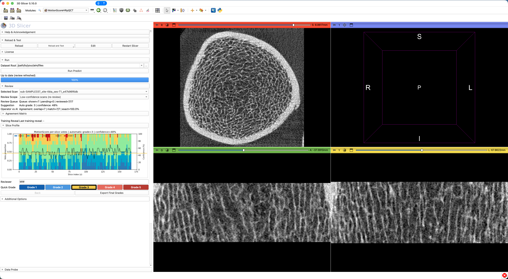

# SlicerMotionScoreHRpQCT

SlicerMotionScoreHRpQCT is a 3D Slicer extension for fast, reviewer-driven motion grading of HR-pQCT scans using the MotionScore core pipeline. It supports one-click prediction, rapid manual grading, reviewer tracking, and export-ready grading tables for downstream analysis.

No known related patents.

License: MIT (see [LICENSE.txt](LICENSE.txt)).

Repositories:
- Slicer extension (this repo): https://github.com/wallematthias/SlicerMotionScoreHRpQCT
- Core pipeline: https://github.com/wallematthias/MotionScoreHRpQCT

## Module Overview

### MotionScoreHRpQCT

This scripted module provides the full extension workflow:
- run `motionscore predict` from dataset root,
- review scans with quick grades and reviewer attribution,
- monitor agreement metrics,
- export consolidated final grade tables.

## Typical Tutorial Workflow

1. Set `Dataset Root`.
2. Click `One-Click Setup` once (installs `motionscorehrpqct` from PyPI, activates license, downloads models).
   - Optional: use `Force Reinstall Package` in `License` if you need to refresh a broken/outdated local install.
3. Click `Run Predict` (torch backend).
   - Optional: choose `Torch Device` in `Additional Options` (`auto`, `mps`, `cpu`, `cuda`).
4. In `Review`, enter reviewer ID once.
5. For each scan, click quick grade (`Grade 1..5`) to save and advance.
6. Use `Back` to revisit and overwrite accidental grading.
7. Click `Export Final Grades` when complete.

Output path:
- `<dataset_root>/MotionScore`

## Core Pipeline Contract

This extension is GUI-only and delegates persistent data processing to the core repository `MotionScoreHRpQCT`:
- `motionscore predict`
- `motionscore review-init`
- `motionscore review-apply`
- `motionscore review-clear`
- `motionscore export`

The extension does not maintain ad hoc sidecar state; review state is read from and written to derivatives managed by the core CLI.

## Privacy and Safety

- The extension does not upload user data by default.
- Network calls are only made when users explicitly trigger license setup/model download features.
- The extension does not include untrusted third-party binaries.
- Model weights are licensed for usage tracking; in the current deployment flow, licenses are automatically granted at signup.

## Publication

Walle, M., Eggemann, D., Atkins, P.R., Kendall, J.J., Stock, K., Müller, R. and Collins, C.J., 2023. Motion grading of high-resolution quantitative computed tomography supported by deep convolutional neural networks. *Bone*, 166, p.116607.  
https://doi.org/10.1016/j.bone.2022.116607

## Developer Install

1. Clone this repository.
2. Register module path using Slicer's embedded Python environment:
   - Launch Slicer and run from the Python interactor:
   - `exec(open(r"<repo>/scripts/link_local_module.py").read(), {"__name__": "__main__"})`
   - Or run from a terminal with your platform-specific Slicer launcher:
   - `"<SLICER_LAUNCHER>" --no-splash --no-main-window --python-script "<repo>/scripts/link_local_module.py"`
3. Restart Slicer and open module `MotionScoreHRpQCT`.
4. Install the core package into Slicer's Python (platform-agnostic):
   - `"<SLICER_PYTHON>" -m pip install -e "<path-to>/MotionScoreHRpQCT"`
   - where `<SLICER_PYTHON>` is your Slicer Python executable (for example `PythonSlicer`).

## CI/CD

This repository intentionally has no CI workflows. Packaging and release checks are run manually.
